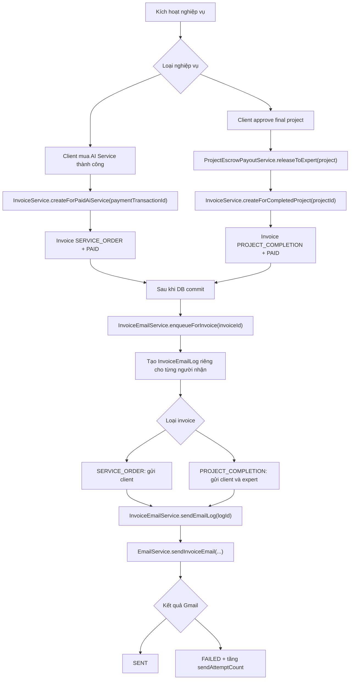
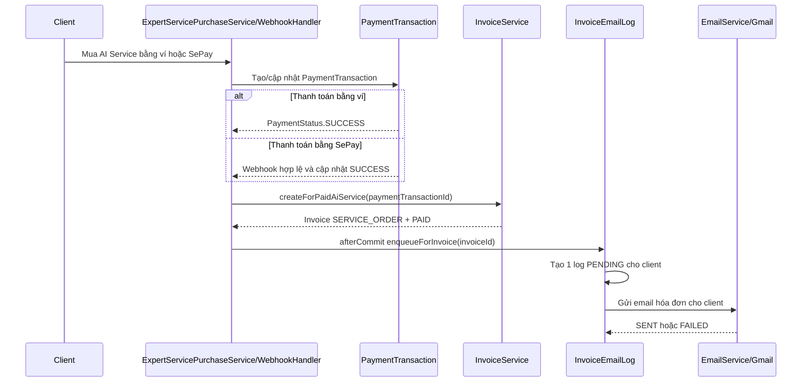
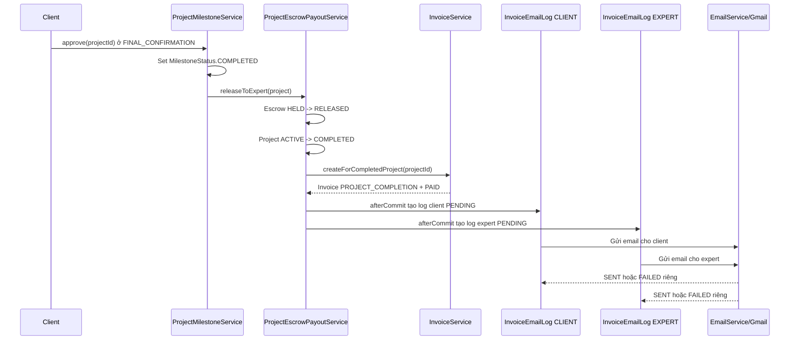
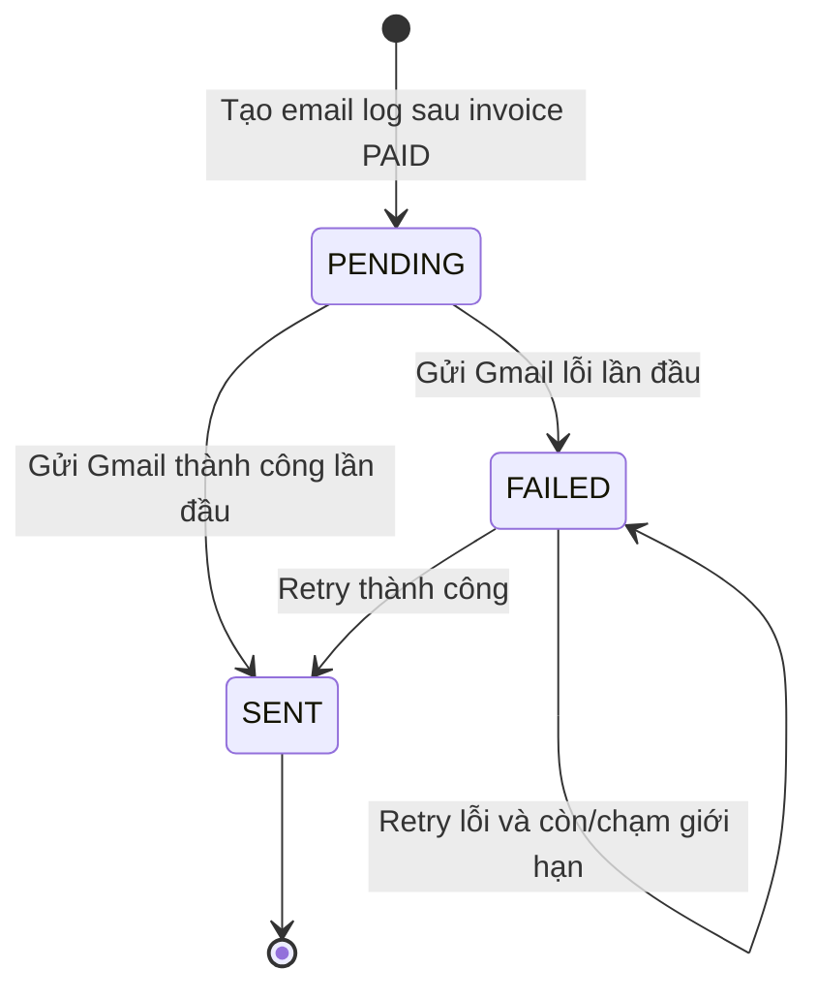
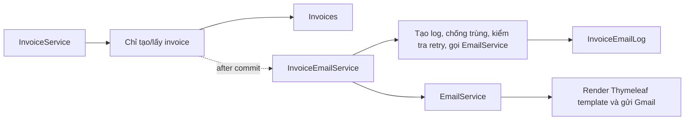
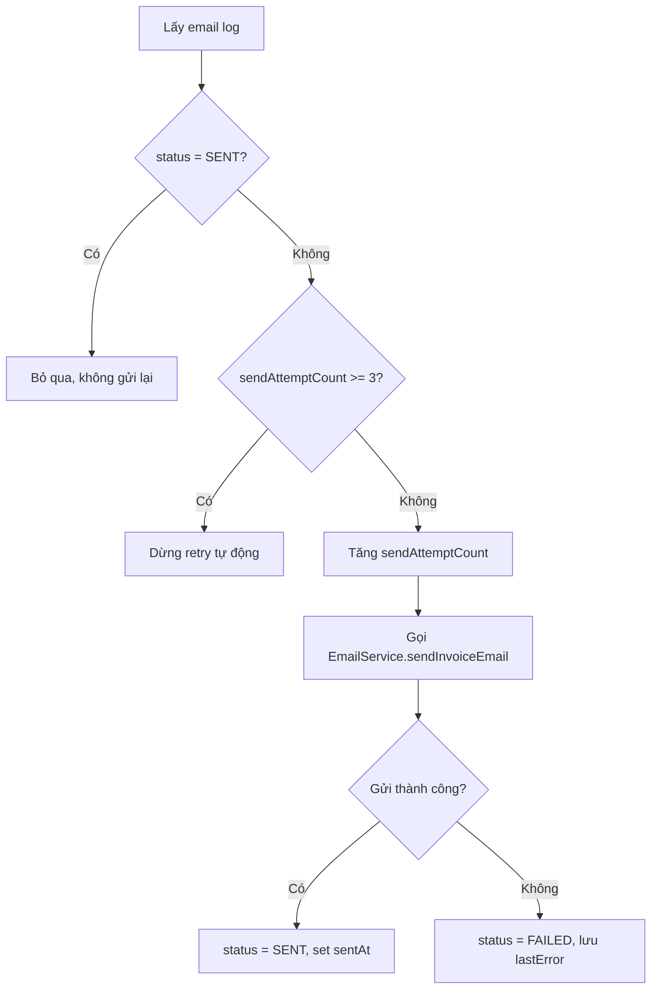

# Thiết Kế Luồng Gửi Email Hóa Đơn

## 1. Trạng Thái Tài Liệu

Tài liệu này là bản thiết kế đầy đủ để review trước khi bắt đầu code thật.

Hiện tại tài liệu chỉ mô tả luồng xử lý, trạng thái, service boundary, dữ liệu cần lưu, cơ chế retry và code mẫu. Chưa có thay đổi runtime nào được áp dụng vào source code chính.

## 2. Mục Tiêu

Thiết kế luồng gửi email hóa đơn bằng hệ thống Gmail có sẵn trong dự án cho 2 nghiệp vụ:

- Client mua AI Service thành công.
- Project hoàn thành, hệ thống gửi hóa đơn/thông tin thanh toán cho cả client và expert.

Yêu cầu chính:

- Dùng invoice đã có trong hệ thống.
- Dùng `EmailService`/Gmail đã có.
- Không trộn trạng thái gửi email vào `InvoiceStatus`.
- Bên nào gửi email lỗi thì retry riêng bên đó, không gửi lại cho bên đã nhận thành công.
- Có giới hạn số lần gửi để tránh gửi vô hạn hoặc spam Gmail.

## 3. Các Điểm Có Sẵn Trong Dự Án

Các thành phần hiện có liên quan trực tiếp:

- `InvoiceService#createForPaidAiService(paymentTransactionId)`: tạo invoice `SERVICE_ORDER` sau khi client mua AI Service thành công.
- `InvoiceService#createForCompletedProject(projectId)`: tạo invoice `PROJECT_COMPLETION` sau khi project hoàn thành và escrow đã release.
- `EmailService`: đã dùng `JavaMailSender` và Thymeleaf template để gửi email HTML.
- `ExpertServicePurchaseService`: xử lý luồng mua AI Service bằng ví nội bộ.
- `ExpertServicePurchaseWebhookHandler`: xử lý luồng mua AI Service bằng SePay webhook.
- `ProjectMilestoneService`: xử lý client approve từng milestone và final confirmation.
- `ProjectEscrowPayoutService#releaseToExpert(project)`: xử lý release escrow, chuyển tiền expert, set project completed và tạo invoice project.

## 4. Quyết Định Thiết Kế Chính

### 4.1. Không Trộn `InvoiceStatus` Và `InvoiceEmailStatus`

`InvoiceStatus` chỉ phản ánh trạng thái nghiệp vụ hóa đơn:

- `PAID`: hóa đơn đã hợp lệ sau thanh toán/hoàn tất.
- `CANCELLED`: hóa đơn bị hủy nếu sau này có nghiệp vụ cần.

`InvoiceEmailStatus` chỉ phản ánh trạng thái gửi email hóa đơn:

- Email đã chờ gửi hay chưa.
- Email đã gửi thành công hay chưa.
- Email đã gửi lỗi hay chưa.

Lý do tách riêng:

- Invoice có thể `PAID` dù email gửi lỗi.
- Email gửi lỗi không được rollback payment, escrow, project completion hoặc invoice.
- Mỗi recipient cần trạng thái gửi riêng.

### 4.2. Bộ Status Tối Giản Cho MVP

Vì scope dự án ngắn, chỉ cần 3 trạng thái:

| Status | Ý nghĩa | Khi nào set |
| --- | --- | --- |
| `PENDING` | Đã có email job nhưng chưa gửi thành công | Sau khi invoice `PAID` được tạo hoặc lấy ra |
| `SENT` | Email đã gửi thành công qua Gmail | `mailSender.send(...)` chạy không lỗi |
| `FAILED` | Email gửi thất bại | Gmail, SMTP, template, recipient hoặc validation lỗi |

Các status không dùng:

| Status bỏ đi | Lý do |
| --- | --- |
| `SENDING` | Trạng thái quá ngắn, không cần lưu database |
| `RETRYING` | Có thể biểu diễn bằng `FAILED` + `sendAttemptCount < MAX_SEND_ATTEMPT` |
| `FAILED_PERMANENT` | Quá chi tiết cho MVP, chỉ cần `FAILED` + `sendAttemptCount >= MAX_SEND_ATTEMPT` |

## 5. Luồng Tổng Quan



## 6. Luồng 1: Client Mua AI Service



Rule:

- Chỉ tạo/gửi email khi payment đã `SUCCESS`.
- Chỉ áp dụng cho `TransactionType.EXPERT_SERVICE_PURCHASE`.
- Chỉ áp dụng cho `PaymentReferenceType.EXPERT_SERVICE`.
- Chỉ gửi hóa đơn cho client mua AI Service.
- Expert vẫn nhận notification/realtime như hiện tại, nhưng không bắt buộc nhận invoice email cho luồng mua AI Service.

## 7. Luồng 2: Project Hoàn Thành



Rule:

- Chỉ gửi khi `ProjectStatus.COMPLETED`.
- Chỉ gửi khi `EscrowStatus.RELEASED`.
- Invoice type phải là `PROJECT_COMPLETION`.
- Tạo 2 email log riêng:
  - Một log cho `invoice.clientId` với role `CLIENT`.
  - Một log cho `invoice.expertId` với role `EXPERT`.

## 8. Vì Sao Cần Log Riêng Cho Từng Bên?

Với project completion, client và expert có thể có kết quả gửi email khác nhau.

Ví dụ invoice id `10`:

| invoiceId | recipientRole | recipientUserId | status | sendAttemptCount |
| --- | --- | ---: | --- | ---: |
| `10` | `CLIENT` | `101` | `SENT` | `1` |
| `10` | `EXPERT` | `202` | `FAILED` | `3` |

Ý nghĩa:

- Client đã nhận email thành công.
- Expert chưa nhận email vì gửi lỗi 3 lần.
- Khi retry, hệ thống chỉ retry dòng của expert.
- Không gửi lại cho client vì log client đã `SENT`.

Bảng kết quả:

| Client email | Expert email | Kết quả |
| --- | --- | --- |
| `SENT` | `SENT` | Cả hai bên đã nhận |
| `SENT` | `FAILED` | Client đã nhận, expert chưa nhận |
| `FAILED` | `SENT` | Expert đã nhận, client chưa nhận |
| `FAILED` | `FAILED` | Cả hai bên chưa nhận |

## 9. Giới Hạn Số Lần Gửi

Cần giới hạn số lần gửi để:

- Tránh vòng lặp gửi email vô hạn.
- Tránh spam người dùng.
- Tránh Gmail/SMTP bị khóa hoặc bị rate limit.
- Giữ hệ thống dễ kiểm soát trong MVP.

Đề xuất:

```text
MAX_SEND_ATTEMPT = 3
```

Ý nghĩa:

- Mỗi email log được thử gửi tối đa 3 lần.
- Mỗi lần thử gửi, dù thành công hay thất bại, đều tăng `sendAttemptCount`.
- Nếu `status = FAILED` và `sendAttemptCount >= 3`, hệ thống không retry tự động nữa.
- Admin/dev có thể xử lý thủ công hoặc tạo chức năng resend sau.

### 9.1. Vì Sao Dùng `sendAttemptCount` Thay Vì `retryCount`?

`retryCount` dễ bị hiểu là chỉ đếm số lần gửi lại sau lần đầu.

`sendAttemptCount` rõ hơn vì nó đếm tổng số lần hệ thống đã thử gửi:

- Lần gửi đầu tiên.
- Các lần retry sau đó.

Ví dụ:

| Thời điểm | status | sendAttemptCount | Ý nghĩa |
| --- | --- | ---: | --- |
| Vừa tạo log | `PENDING` | `0` | Chưa thử gửi |
| Gửi lần 1 lỗi | `FAILED` | `1` | Đã thử 1 lần |
| Gửi lần 2 lỗi | `FAILED` | `2` | Đã thử 2 lần |
| Gửi lần 3 lỗi | `FAILED` | `3` | Dừng retry tự động |
| Retry thủ công thành công | `SENT` | `4` | Admin/dev chủ động gửi lại |

## 10. Sơ Đồ Trạng Thái Tối Giản



Không cần trạng thái `RETRYING`. Khi một log đang `FAILED` nhưng `sendAttemptCount < MAX_SEND_ATTEMPT`, nghĩa là log đó vẫn còn được phép retry.

## 11. Service Boundary Đề Xuất



Trách nhiệm từng service:

| Service | Trách nhiệm |
| --- | --- |
| `InvoiceService` | Tạo hoặc lấy invoice hợp lệ |
| `InvoiceEmailService` | Tạo email log, chọn recipient, chống gửi trùng, kiểm soát số lần gửi, cập nhật `SENT/FAILED` |
| `EmailService` | Render HTML template và gọi `JavaMailSender` |
| `ProjectEscrowPayoutService` | Hoàn tất project, release escrow, gọi tạo invoice rồi kích hoạt email sau commit |
| `ExpertServicePurchaseService/WebhookHandler` | Xử lý payment success, gọi tạo invoice rồi kích hoạt email sau commit |

## 12. Data Model Đề Xuất

### 12.1. `InvoiceEmailStatus`

```java
public enum InvoiceEmailStatus { // GHI CHÚ: Enum riêng cho trạng thái gửi email hóa đơn.
    PENDING, // GHI CHÚ: Email log đã được tạo nhưng chưa gửi thành công.
    SENT, // GHI CHÚ: Email đã gửi thành công qua Gmail.
    FAILED // GHI CHÚ: Email gửi lỗi, cần xem lastError hoặc retry nếu còn lượt.
} // GHI CHÚ: Kết thúc enum trạng thái gửi email.
```

### 12.2. `InvoiceEmailType`

```java
public enum InvoiceEmailType { // GHI CHÚ: Phân biệt loại email theo nghiệp vụ.
    SERVICE_ORDER_PAID, // GHI CHÚ: Email hóa đơn khi client mua AI Service thành công.
    PROJECT_COMPLETION_PAID // GHI CHÚ: Email hóa đơn khi project hoàn thành.
} // GHI CHÚ: Kết thúc enum loại email.
```

### 12.3. `InvoiceEmailRecipientRole`

```java
public enum InvoiceEmailRecipientRole { // GHI CHÚ: Phân biệt vai trò người nhận email.
    CLIENT, // GHI CHÚ: Người mua AI Service hoặc chủ project.
    EXPERT // GHI CHÚ: Expert nhận tiền khi project hoàn thành.
} // GHI CHÚ: Kết thúc enum vai trò người nhận.
```

### 12.4. `InvoiceEmailLog`

```java
@Entity // GHI CHÚ: Đánh dấu class là JPA entity.
@Table( // GHI CHÚ: Cấu hình bảng lưu log gửi email hóa đơn.
        name = "invoice_email_logs", // GHI CHÚ: Tên bảng trong database.
        uniqueConstraints = { // GHI CHÚ: Danh sách unique constraint.
                @UniqueConstraint( // GHI CHÚ: Constraint chống tạo trùng email log.
                        name = "uk_invoice_email_recipient", // GHI CHÚ: Tên constraint để dễ đọc lỗi duplicate.
                        columnNames = { // GHI CHÚ: Các cột tạo thành unique key.
                                "invoice_id", // GHI CHÚ: Một invoice cụ thể.
                                "recipient_user_id", // GHI CHÚ: Một người nhận cụ thể.
                                "recipient_role", // GHI CHÚ: Vai trò người nhận trong invoice.
                                "email_type" // GHI CHÚ: Loại email cần gửi.
                        } // GHI CHÚ: Kết thúc danh sách cột unique.
                ) // GHI CHÚ: Kết thúc unique constraint.
        } // GHI CHÚ: Kết thúc danh sách constraint.
) // GHI CHÚ: Kết thúc cấu hình table.
public class InvoiceEmailLog { // GHI CHÚ: Entity đại diện cho một email cần gửi cho một người nhận.
    @Id // GHI CHÚ: Khóa chính của log.
    @GeneratedValue(strategy = GenerationType.IDENTITY) // GHI CHÚ: Database tự tăng id.
    private Long invoiceEmailLogId; // GHI CHÚ: Id riêng của email log.

    @Column(name = "invoice_id", nullable = false) // GHI CHÚ: Email log bắt buộc thuộc về một invoice.
    private Long invoiceId; // GHI CHÚ: Id của invoice trong bảng invoices.

    @Column(name = "recipient_user_id", nullable = false) // GHI CHÚ: Bắt buộc biết user nhận email.
    private Long recipientUserId; // GHI CHÚ: User id của client hoặc expert.

    @Column(name = "recipient_email", nullable = false) // GHI CHÚ: Lưu email snapshot tại thời điểm tạo log.
    private String recipientEmail; // GHI CHÚ: Địa chỉ email sẽ gửi qua Gmail.

    @Enumerated(EnumType.STRING) // GHI CHÚ: Lưu enum bằng chuỗi để dễ đọc database.
    @Column(name = "recipient_role", nullable = false) // GHI CHÚ: Role người nhận không được null.
    private InvoiceEmailRecipientRole recipientRole; // GHI CHÚ: CLIENT hoặc EXPERT.

    @Enumerated(EnumType.STRING) // GHI CHÚ: Lưu enum bằng chuỗi để tránh lỗi đổi thứ tự enum.
    @Column(name = "email_type", nullable = false) // GHI CHÚ: Loại email không được null.
    private InvoiceEmailType emailType; // GHI CHÚ: SERVICE_ORDER_PAID hoặc PROJECT_COMPLETION_PAID.

    @Enumerated(EnumType.STRING) // GHI CHÚ: Lưu status bằng chuỗi.
    @Column(name = "status", nullable = false) // GHI CHÚ: Trạng thái gửi email không được null.
    private InvoiceEmailStatus status; // GHI CHÚ: PENDING, SENT hoặc FAILED.

    @Column(name = "send_attempt_count", nullable = false) // GHI CHÚ: Đếm tổng số lần hệ thống đã thử gửi.
    private Integer sendAttemptCount; // GHI CHÚ: Tăng lên mỗi lần gọi gửi Gmail.

    @Column(name = "last_error", columnDefinition = "TEXT") // GHI CHÚ: Lưu lỗi cuối cùng nếu gửi thất bại.
    private String lastError; // GHI CHÚ: Dùng để debug hoặc hiển thị cho admin/dev.

    @Column(name = "sent_at") // GHI CHÚ: Chỉ có giá trị khi gửi thành công.
    private LocalDateTime sentAt; // GHI CHÚ: Thời điểm email được gửi thành công.

    @Column(name = "created_at", nullable = false) // GHI CHÚ: Thời điểm tạo email log.
    private LocalDateTime createdAt; // GHI CHÚ: Dùng để sort hoặc audit.

    @Column(name = "updated_at", nullable = false) // GHI CHÚ: Thời điểm cập nhật log gần nhất.
    private LocalDateTime updatedAt; // GHI CHÚ: Cập nhật khi status/sendAttemptCount thay đổi.
} // GHI CHÚ: Kết thúc entity InvoiceEmailLog.
```

## 13. Repository Đề Xuất

```java
public interface InvoiceEmailLogRepo extends JpaRepository<InvoiceEmailLog, Long> { // GHI CHÚ: Repository thao tác bảng invoice_email_logs.
    Optional<InvoiceEmailLog> findByInvoiceIdAndRecipientUserIdAndRecipientRoleAndEmailType( // GHI CHÚ: Tìm log cũ theo unique key nghiệp vụ.
            Long invoiceId, // GHI CHÚ: Invoice cần gửi email.
            Long recipientUserId, // GHI CHÚ: User nhận email.
            InvoiceEmailRecipientRole recipientRole, // GHI CHÚ: Vai trò người nhận.
            InvoiceEmailType emailType // GHI CHÚ: Loại email.
    ); // GHI CHÚ: Nếu đã có log thì không tạo thêm log mới.

    List<InvoiceEmailLog> findByStatusAndSendAttemptCountLessThanOrderByCreatedAtAsc( // GHI CHÚ: Dùng nếu sau này có scheduler retry tự động.
            InvoiceEmailStatus status, // GHI CHÚ: Thường truyền FAILED hoặc PENDING.
            Integer maxSendAttempt // GHI CHÚ: Chỉ lấy log còn dưới giới hạn gửi.
    ); // GHI CHÚ: Lấy danh sách log còn được phép retry.
} // GHI CHÚ: Kết thúc repository.
```

## 14. Service Xử Lý Email Hóa Đơn

```java
@Service // GHI CHÚ: Đánh dấu đây là Spring service.
@RequiredArgsConstructor // GHI CHÚ: Lombok tạo constructor cho các dependency final.
public class InvoiceEmailService { // GHI CHÚ: Service riêng xử lý email invoice.
    private static final int MAX_SEND_ATTEMPT = 3; // GHI CHÚ: Giới hạn số lần thử gửi tự động cho mỗi email log.

    private final InvoicesRepo invoicesRepo; // GHI CHÚ: Dùng để lấy invoice theo invoiceId.
    private final UserRepo userRepo; // GHI CHÚ: Dùng để lấy thông tin email client/expert.
    private final InvoiceEmailLogRepo invoiceEmailLogRepo; // GHI CHÚ: Dùng để tạo/cập nhật log gửi email.
    private final EmailService emailService; // GHI CHÚ: Dùng hệ thống Gmail có sẵn.

    @Transactional // GHI CHÚ: Tạo email log trong transaction.
    public void enqueueForInvoice(Long invoiceId) { // GHI CHÚ: Tạo các email log cần thiết cho một invoice.
        Invoices invoice = invoicesRepo.findById(invoiceId) // GHI CHÚ: Lấy invoice đã được tạo bởi InvoiceService.
                .orElseThrow(() -> new GlobalException(404, "Invoice not found")); // GHI CHÚ: Báo lỗi nếu invoice không tồn tại.

        if (!InvoiceStatus.PAID.equals(invoice.getInvoiceStatus())) { // GHI CHÚ: Chỉ invoice PAID mới được gửi email.
            throw new GlobalException(400, "Only paid invoices can be emailed"); // GHI CHÚ: Chặn gửi email cho invoice chưa hợp lệ.
        } // GHI CHÚ: Kết thúc kiểm tra invoice status.

        if (InvoiceType.SERVICE_ORDER.equals(invoice.getInvoiceType())) { // GHI CHÚ: Case client mua AI Service.
            createPendingEmailIfMissing( // GHI CHÚ: Tạo log nếu chưa có.
                    invoice, // GHI CHÚ: Invoice cần gửi.
                    invoice.getClientId(), // GHI CHÚ: Người nhận là client mua service.
                    InvoiceEmailRecipientRole.CLIENT, // GHI CHÚ: Vai trò người nhận là client.
                    InvoiceEmailType.SERVICE_ORDER_PAID // GHI CHÚ: Loại email là hóa đơn AI Service.
            ); // GHI CHÚ: Kết thúc tạo log cho client.
            return; // GHI CHÚ: AI Service chỉ cần gửi invoice email cho client.
        } // GHI CHÚ: Kết thúc case SERVICE_ORDER.

        if (InvoiceType.PROJECT_COMPLETION.equals(invoice.getInvoiceType())) { // GHI CHÚ: Case project hoàn thành.
            createPendingEmailIfMissing( // GHI CHÚ: Tạo log cho client.
                    invoice, // GHI CHÚ: Invoice project completion.
                    invoice.getClientId(), // GHI CHÚ: Client chủ project.
                    InvoiceEmailRecipientRole.CLIENT, // GHI CHÚ: Nội dung email theo vai trò client.
                    InvoiceEmailType.PROJECT_COMPLETION_PAID // GHI CHÚ: Loại email là project completion.
            ); // GHI CHÚ: Kết thúc tạo log client.

            createPendingEmailIfMissing( // GHI CHÚ: Tạo log cho expert.
                    invoice, // GHI CHÚ: Invoice project completion.
                    invoice.getExpertId(), // GHI CHÚ: Expert nhận tiền sau escrow release.
                    InvoiceEmailRecipientRole.EXPERT, // GHI CHÚ: Nội dung email theo vai trò expert.
                    InvoiceEmailType.PROJECT_COMPLETION_PAID // GHI CHÚ: Cùng loại email nhưng khác recipient role.
            ); // GHI CHÚ: Kết thúc tạo log expert.
        } // GHI CHÚ: Kết thúc case PROJECT_COMPLETION.
    } // GHI CHÚ: Kết thúc hàm enqueueForInvoice.

    @Transactional // GHI CHÚ: Cập nhật status và attempt count trong transaction.
    public void sendEmailLog(Long invoiceEmailLogId) { // GHI CHÚ: Gửi một email dựa trên log id.
        InvoiceEmailLog log = invoiceEmailLogRepo.findById(invoiceEmailLogId) // GHI CHÚ: Lấy log cần gửi.
                .orElseThrow(() -> new GlobalException(404, "Invoice email log not found")); // GHI CHÚ: Báo lỗi nếu log không tồn tại.

        if (InvoiceEmailStatus.SENT.equals(log.getStatus())) { // GHI CHÚ: Nếu log đã gửi thành công.
            return; // GHI CHÚ: Không gửi lại để tránh duplicate email.
        } // GHI CHÚ: Kết thúc guard SENT.

        if (hasReachedMaxAttempt(log)) { // GHI CHÚ: Nếu log đã chạm giới hạn số lần gửi.
            return; // GHI CHÚ: Không retry tự động nữa.
        } // GHI CHÚ: Kết thúc guard giới hạn gửi.

        Invoices invoice = invoicesRepo.findById(log.getInvoiceId()) // GHI CHÚ: Lấy invoice gốc để render email.
                .orElseThrow(() -> new GlobalException(404, "Invoice not found")); // GHI CHÚ: Báo lỗi nếu invoice không tồn tại.

        log.setSendAttemptCount(defaultZero(log.getSendAttemptCount()) + 1); // GHI CHÚ: Tăng số lần thử gửi trước khi gọi Gmail.
        log.setUpdatedAt(LocalDateTime.now()); // GHI CHÚ: Cập nhật thời điểm thử gửi.

        try { // GHI CHÚ: Bắt đầu vùng có thể lỗi vì Gmail/template.
            emailService.sendInvoiceEmail( // GHI CHÚ: Gọi EmailService để gửi email thật.
                    log.getRecipientEmail(), // GHI CHÚ: Email người nhận.
                    log.getRecipientRole(), // GHI CHÚ: CLIENT hoặc EXPERT.
                    log.getEmailType(), // GHI CHÚ: Loại email cần gửi.
                    invoice // GHI CHÚ: Dữ liệu invoice dùng trong template.
            ); // GHI CHÚ: Kết thúc gọi EmailService.

            log.setStatus(InvoiceEmailStatus.SENT); // GHI CHÚ: Mark thành công nếu không có exception.
            log.setSentAt(LocalDateTime.now()); // GHI CHÚ: Lưu thời điểm gửi thành công.
            log.setLastError(null); // GHI CHÚ: Xóa lỗi cũ nếu lần retry này thành công.
        } catch (Exception exception) { // GHI CHÚ: Bắt mọi lỗi gửi email.
            log.setStatus(InvoiceEmailStatus.FAILED); // GHI CHÚ: Mark FAILED để biết log này chưa gửi được.
            log.setLastError(exception.getMessage()); // GHI CHÚ: Lưu lỗi gần nhất để debug.
        } // GHI CHÚ: Kết thúc try/catch.

        log.setUpdatedAt(LocalDateTime.now()); // GHI CHÚ: Cập nhật thời điểm thay đổi trạng thái.
        invoiceEmailLogRepo.save(log); // GHI CHÚ: Lưu status, attempt count và lỗi vào database.
    } // GHI CHÚ: Kết thúc hàm sendEmailLog.

    private void createPendingEmailIfMissing( // GHI CHÚ: Helper tạo email log nếu chưa tồn tại.
            Invoices invoice, // GHI CHÚ: Invoice gốc.
            Long recipientUserId, // GHI CHÚ: User id người nhận.
            InvoiceEmailRecipientRole role, // GHI CHÚ: Vai trò người nhận.
            InvoiceEmailType emailType // GHI CHÚ: Loại email.
    ) { // GHI CHÚ: Bắt đầu helper.
        if (recipientUserId == null) { // GHI CHÚ: Nếu invoice không có recipient.
            return; // GHI CHÚ: Bỏ qua để tránh lỗi null.
        } // GHI CHÚ: Kết thúc guard null recipient.

        User recipient = userRepo.findById(recipientUserId) // GHI CHÚ: Lấy user để lấy email.
                .orElseThrow(() -> new GlobalException(404, "Invoice email recipient not found")); // GHI CHÚ: Báo lỗi nếu user không tồn tại.

        invoiceEmailLogRepo // GHI CHÚ: Bắt đầu tìm log cũ.
                .findByInvoiceIdAndRecipientUserIdAndRecipientRoleAndEmailType( // GHI CHÚ: Tìm theo unique key.
                        invoice.getInvoiceId(), // GHI CHÚ: Invoice id.
                        recipientUserId, // GHI CHÚ: User id người nhận.
                        role, // GHI CHÚ: Vai trò người nhận.
                        emailType // GHI CHÚ: Loại email.
                ) // GHI CHÚ: Kết thúc tham số tìm kiếm.
                .orElseGet(() -> invoiceEmailLogRepo.save( // GHI CHÚ: Nếu chưa có thì tạo mới.
                        InvoiceEmailLog.builder() // GHI CHÚ: Dùng builder nếu entity có @Builder khi implement.
                                .invoiceId(invoice.getInvoiceId()) // GHI CHÚ: Gắn invoice id.
                                .recipientUserId(recipientUserId) // GHI CHÚ: Gắn user id người nhận.
                                .recipientEmail(recipient.getEmail()) // GHI CHÚ: Snapshot email hiện tại của user.
                                .recipientRole(role) // GHI CHÚ: Gắn role người nhận.
                                .emailType(emailType) // GHI CHÚ: Gắn loại email.
                                .status(InvoiceEmailStatus.PENDING) // GHI CHÚ: Trạng thái ban đầu là PENDING.
                                .sendAttemptCount(0) // GHI CHÚ: Chưa thử gửi lần nào.
                                .createdAt(LocalDateTime.now()) // GHI CHÚ: Thời điểm tạo log.
                                .updatedAt(LocalDateTime.now()) // GHI CHÚ: Thời điểm cập nhật ban đầu.
                                .build() // GHI CHÚ: Tạo object InvoiceEmailLog.
                )); // GHI CHÚ: Lưu log mới nếu cần.
    } // GHI CHÚ: Kết thúc helper createPendingEmailIfMissing.

    private boolean hasReachedMaxAttempt(InvoiceEmailLog log) { // GHI CHÚ: Kiểm tra log đã hết lượt gửi tự động chưa.
        return defaultZero(log.getSendAttemptCount()) >= MAX_SEND_ATTEMPT; // GHI CHÚ: Đúng nếu số lần thử gửi đã đạt giới hạn.
    } // GHI CHÚ: Kết thúc hàm kiểm tra giới hạn.

    private int defaultZero(Integer value) { // GHI CHÚ: Helper tránh null cho số đếm.
        return value == null ? 0 : value; // GHI CHÚ: Nếu null thì xem như 0.
    } // GHI CHÚ: Kết thúc helper defaultZero.
} // GHI CHÚ: Kết thúc InvoiceEmailService.
```

## 15. After-Commit Hook

Side effect gửi email phải chạy sau khi database commit thành công.

Lý do:

- Nếu gửi email trước commit rồi transaction rollback, người dùng nhận email sai.
- Payment/project/escrow/invoice là nghiệp vụ chính, email chỉ là side effect.
- Email fail không được làm rollback nghiệp vụ chính.

```java
private void runAfterCommit(Runnable action) { // GHI CHÚ: Helper chạy side effect sau khi transaction commit.
    if (!TransactionSynchronizationManager.isSynchronizationActive()) { // GHI CHÚ: Nếu hiện tại không có transaction.
        action.run(); // GHI CHÚ: Chạy ngay vì không có after-commit hook.
        return; // GHI CHÚ: Thoát hàm sau khi chạy.
    } // GHI CHÚ: Kết thúc guard không có transaction.

    TransactionSynchronizationManager.registerSynchronization( // GHI CHÚ: Đăng ký callback với transaction hiện tại.
            new TransactionSynchronization() { // GHI CHÚ: Tạo callback object.
                @Override // GHI CHÚ: Override hook của Spring.
                public void afterCommit() { // GHI CHÚ: Hàm này chạy sau khi commit thành công.
                    action.run(); // GHI CHÚ: Bắt đầu enqueue/gửi email sau commit.
                } // GHI CHÚ: Kết thúc afterCommit.
            } // GHI CHÚ: Kết thúc callback object.
    ); // GHI CHÚ: Kết thúc đăng ký synchronization.
} // GHI CHÚ: Kết thúc helper runAfterCommit.
```

Gắn vào luồng AI Service:

```java
Invoices invoice = invoiceService.createForPaidAiService( // GHI CHÚ: Tạo hoặc lấy invoice sau khi payment success.
        paymentTransaction.getPaymentTransactionId() // GHI CHÚ: Truyền payment transaction id vừa thành công.
); // GHI CHÚ: Kết thúc tạo invoice AI Service.

runAfterCommit(() -> invoiceEmailService.enqueueForInvoice(invoice.getInvoiceId())); // GHI CHÚ: Sau commit mới tạo email log.
```

Gắn vào luồng project completion:

```java
Invoices invoice = invoiceService.createForCompletedProject(project.getProjectId()); // GHI CHÚ: Tạo hoặc lấy invoice khi project COMPLETED và escrow RELEASED.

runAfterCommit(() -> invoiceEmailService.enqueueForInvoice(invoice.getInvoiceId())); // GHI CHÚ: Sau commit mới tạo email log cho client và expert.
```

## 16. EmailService Method Đề Xuất

```java
public void sendInvoiceEmail( // GHI CHÚ: Method mới trong EmailService để gửi invoice email.
        String to, // GHI CHÚ: Địa chỉ email người nhận.
        InvoiceEmailRecipientRole recipientRole, // GHI CHÚ: CLIENT hoặc EXPERT.
        InvoiceEmailType emailType, // GHI CHÚ: Loại email cần gửi.
        Invoices invoice // GHI CHÚ: Dữ liệu invoice để render template.
) { // GHI CHÚ: Bắt đầu method gửi invoice email.
    try { // GHI CHÚ: Bắt lỗi liên quan đến template/MIME/Gmail.
        Context context = new Context(); // GHI CHÚ: Tạo Thymeleaf context.
        context.setVariable("invoice", invoice); // GHI CHÚ: Đưa invoice vào template.
        context.setVariable("recipientRole", recipientRole); // GHI CHÚ: Đưa vai trò người nhận vào template.
        context.setVariable("emailType", emailType); // GHI CHÚ: Đưa loại email vào template.

        String htmlContent = templateEngine.process("invoice-paid", context); // GHI CHÚ: Render template invoice-paid.html.

        MimeMessage message = mailSender.createMimeMessage(); // GHI CHÚ: Tạo MIME message.
        MimeMessageHelper helper = new MimeMessageHelper(message, true, "UTF-8"); // GHI CHÚ: Hỗ trợ HTML body và UTF-8.

        helper.setTo(to); // GHI CHÚ: Set địa chỉ người nhận.
        helper.setSubject(buildInvoiceSubject(emailType, invoice)); // GHI CHÚ: Set tiêu đề email theo loại invoice.
        helper.setText(htmlContent, true); // GHI CHÚ: Set nội dung HTML.

        mailSender.send(message); // GHI CHÚ: Gửi email qua Gmail SMTP.
    } catch (Exception exception) { // GHI CHÚ: Bắt lỗi để caller mark FAILED.
        throw new RuntimeException("Failed to send invoice email", exception); // GHI CHÚ: Ném lỗi cho InvoiceEmailService xử lý.
    } // GHI CHÚ: Kết thúc try/catch.
} // GHI CHÚ: Kết thúc method sendInvoiceEmail.
```

Subject đề xuất:

| Email type | Recipient role | Subject |
| --- | --- | --- |
| `SERVICE_ORDER_PAID` | `CLIENT` | `AITasker - Hóa đơn mua AI Service {invoiceCode}` |
| `PROJECT_COMPLETION_PAID` | `CLIENT` | `AITasker - Hóa đơn dự án hoàn thành {invoiceCode}` |
| `PROJECT_COMPLETION_PAID` | `EXPERT` | `AITasker - Thông tin thanh toán dự án {invoiceCode}` |

## 17. Template Email Đề Xuất

Đề xuất dùng 2 template riêng để dễ đọc, dễ chỉnh wording và ít logic điều kiện trong HTML:

| Nghiệp vụ | File template | Người nhận |
| --- | --- | --- |
| Client mua AI Service | `invoice-ai-service-paid.html` | Client |
| Project hoàn thành | `invoice-project-completed.html` | Client và expert |

Lý do tách template:

- AI Service là luồng mua sản phẩm/dịch vụ trực tiếp, nội dung email ngắn và tập trung vào thanh toán.
- Project completion là luồng hoàn tất dự án, cần wording khác giữa client và expert.
- Dễ review, dễ demo, ít rủi ro nhầm nội dung giữa hai nghiệp vụ.

### 17.1. Biến Chung Nên Truyền Vào Template

| Biến | Ý nghĩa |
| --- | --- |
| `invoice` | Entity `Invoices` hoặc DTO invoice đã map sẵn |
| `invoice.invoiceCode` | Mã hóa đơn |
| `invoice.invoiceType` | `SERVICE_ORDER` hoặc `PROJECT_COMPLETION` |
| `invoice.description` | Mô tả invoice |
| `invoice.subtotalAmount` | Số tiền expert nhận/net amount |
| `invoice.platformFee` | Phí nền tảng |
| `invoice.taxAmount` | Thuế, hiện tại có thể là `0` |
| `invoice.discountAmount` | Giảm giá, hiện tại có thể là `0` |
| `invoice.totalAmount` | Tổng tiền thanh toán |
| `invoice.currency` | Đơn vị tiền |
| `invoice.paymentMethod` | `WALLET` hoặc `SEPAY` |
| `invoice.paidAt` | Thời điểm thanh toán/hoàn tất |
| `recipientRole` | `CLIENT` hoặc `EXPERT` |
| `emailType` | `SERVICE_ORDER_PAID` hoặc `PROJECT_COMPLETION_PAID` |
| `recipientName` | Tên người nhận, lấy từ `User.fullName`, fallback `bạn` |
| `projectTitle` | Tên project, dùng cho project completion |
| `serviceName` | Tên AI Service, dùng cho AI Service |

### 17.2. Template AI Service Invoice

File đề xuất:

```text
src/main/resources/templates/invoice-ai-service-paid.html
```

Template mẫu:

```html
<!DOCTYPE html> <!-- GHI CHÚ: Khai báo tài liệu HTML cho email client. -->
<html xmlns:th="http://www.thymeleaf.org"> <!-- GHI CHÚ: Bật namespace Thymeleaf để dùng th:text, th:if. -->
<head> <!-- GHI CHÚ: Phần metadata của email. -->
    <meta charset="UTF-8"> <!-- GHI CHÚ: Đảm bảo tiếng Việt hiển thị đúng. -->
    <title>Hóa đơn AI Service</title> <!-- GHI CHÚ: Tiêu đề tài liệu HTML, không nhất thiết là subject email. -->
</head> <!-- GHI CHÚ: Kết thúc head. -->
<body style="font-family: Arial, sans-serif; background-color: #f5f5f5; padding: 24px; color: #1f2937;"> <!-- GHI CHÚ: Style inline để tương thích email client. -->
<div style="max-width: 640px; margin: auto; background: #ffffff; padding: 24px; border-radius: 8px;"> <!-- GHI CHÚ: Khung nội dung chính. -->
    <h2 style="margin-top: 0; color: #111827;">Thanh toán AI Service thành công</h2> <!-- GHI CHÚ: Tiêu đề email cho luồng AI Service, dùng wording tự nhiên hơn. -->

    <p>Xin chào <b th:text="${recipientName}">bạn</b>,</p> <!-- GHI CHÚ: Chào người nhận, fallback là "bạn". -->

    <p>Cảm ơn bạn đã mua AI Service trên AITasker. Hệ thống đã ghi nhận thanh toán và phát hành hóa đơn cho giao dịch này.</p> <!-- GHI CHÚ: Mô tả ngắn gọn kết quả giao dịch và việc phát hành hóa đơn. -->

    <div style="background: #f9fafb; border: 1px solid #e5e7eb; border-radius: 6px; padding: 16px; margin: 20px 0;"> <!-- GHI CHÚ: Khối thông tin hóa đơn. -->
        <p style="margin: 6px 0;"><b>Mã hóa đơn:</b> <span th:text="${invoice.invoiceCode}">INV-20260713-ABC123</span></p> <!-- GHI CHÚ: Hiển thị mã invoice. -->
        <p style="margin: 6px 0;"><b>Dịch vụ:</b> <span th:text="${serviceName}">AI Service</span></p> <!-- GHI CHÚ: Hiển thị tên service nếu service đã được resolve. -->
        <p style="margin: 6px 0;"><b>Nội dung:</b> <span th:text="${invoice.description}">Thanh toán AI Service</span></p> <!-- GHI CHÚ: Mô tả nội dung thanh toán, tránh wording quá kỹ thuật. -->
        <p style="margin: 6px 0;"><b>Phương thức thanh toán:</b> <span th:text="${invoice.paymentMethod}">WALLET</span></p> <!-- GHI CHÚ: WALLET hoặc SEPAY. -->
        <p style="margin: 6px 0;"><b>Thời điểm thanh toán:</b> <span th:text="${invoice.paidAt}">2026-07-13 14:00</span></p> <!-- GHI CHÚ: Có thể format đẹp hơn trong service trước khi đưa vào template. -->
    </div> <!-- GHI CHÚ: Kết thúc khối thông tin hóa đơn. -->

    <table style="width: 100%; border-collapse: collapse; margin-top: 12px;"> <!-- GHI CHÚ: Bảng tiền. -->
        <tr> <!-- GHI CHÚ: Dòng subtotal. -->
            <td style="padding: 8px 0; border-bottom: 1px solid #e5e7eb;">Tạm tính</td> <!-- GHI CHÚ: Label subtotal. -->
            <td style="padding: 8px 0; border-bottom: 1px solid #e5e7eb; text-align: right;" th:text="${invoice.subtotalAmount + ' ' + invoice.currency}">100000 VND</td> <!-- GHI CHÚ: Số tiền subtotal. -->
        </tr> <!-- GHI CHÚ: Kết thúc dòng subtotal. -->
        <tr> <!-- GHI CHÚ: Dòng platform fee. -->
            <td style="padding: 8px 0; border-bottom: 1px solid #e5e7eb;">Phí nền tảng</td> <!-- GHI CHÚ: Label phí nền tảng. -->
            <td style="padding: 8px 0; border-bottom: 1px solid #e5e7eb; text-align: right;" th:text="${invoice.platformFee + ' ' + invoice.currency}">10000 VND</td> <!-- GHI CHÚ: Phí nền tảng. -->
        </tr> <!-- GHI CHÚ: Kết thúc dòng platform fee. -->
        <tr> <!-- GHI CHÚ: Dòng tổng tiền. -->
            <td style="padding: 12px 0; font-size: 16px;"><b>Tổng thanh toán</b></td> <!-- GHI CHÚ: Label tổng tiền. -->
            <td style="padding: 12px 0; font-size: 16px; text-align: right;"><b th:text="${invoice.totalAmount + ' ' + invoice.currency}">110000 VND</b></td> <!-- GHI CHÚ: Tổng tiền thanh toán. -->
        </tr> <!-- GHI CHÚ: Kết thúc dòng tổng tiền. -->
    </table> <!-- GHI CHÚ: Kết thúc bảng tiền. -->

    <p style="margin-top: 24px;">Hóa đơn này đã được lưu trong tài khoản AITasker của bạn để tiện tra cứu và đối chiếu sau này.</p> <!-- GHI CHÚ: Giải thích nơi người dùng có thể xem lại hóa đơn. -->

    <p style="color: #6b7280; font-size: 13px; margin-top: 24px;">Nếu thông tin giao dịch chưa đúng hoặc bạn cần hỗ trợ thêm, vui lòng liên hệ đội ngũ AITasker.</p> <!-- GHI CHÚ: Dòng hỗ trợ mềm hơn, phù hợp email hóa đơn. -->
</div> <!-- GHI CHÚ: Kết thúc khung nội dung. -->
</body> <!-- GHI CHÚ: Kết thúc body. -->
</html> <!-- GHI CHÚ: Kết thúc HTML. -->
```

### 17.3. Template Project Completion Invoice

File đề xuất:

```text
src/main/resources/templates/invoice-project-completed.html
```

Template này dùng chung cho client và expert, đổi wording theo `recipientRole`.

Template mẫu:

```html
<!DOCTYPE html> <!-- GHI CHÚ: Khai báo tài liệu HTML cho email client. -->
<html xmlns:th="http://www.thymeleaf.org"> <!-- GHI CHÚ: Bật namespace Thymeleaf. -->
<head> <!-- GHI CHÚ: Phần metadata. -->
    <meta charset="UTF-8"> <!-- GHI CHÚ: Đảm bảo tiếng Việt hiển thị đúng. -->
    <title>Hóa đơn dự án hoàn thành</title> <!-- GHI CHÚ: Tiêu đề tài liệu HTML. -->
</head> <!-- GHI CHÚ: Kết thúc head. -->
<body style="font-family: Arial, sans-serif; background-color: #f5f5f5; padding: 24px; color: #1f2937;"> <!-- GHI CHÚ: Style inline để tương thích email. -->
<div style="max-width: 680px; margin: auto; background: #ffffff; padding: 24px; border-radius: 8px;"> <!-- GHI CHÚ: Khung nội dung chính. -->
    <h2 style="margin-top: 0; color: #111827;">Dự án đã được xác nhận hoàn thành</h2> <!-- GHI CHÚ: Tiêu đề chung cho project completion. -->

    <p>Xin chào <b th:text="${recipientName}">bạn</b>,</p> <!-- GHI CHÚ: Chào người nhận. -->

    <p th:if="${recipientRole.name() == 'CLIENT'}">Dự án của bạn đã hoàn tất sau bước xác nhận cuối cùng. Hệ thống đã xử lý khoản escrow và phát hành hóa đơn hoàn tất dự án.</p> <!-- GHI CHÚ: Nội dung dành cho client, nói rõ escrow đã được xử lý. -->
    <p th:if="${recipientRole.name() == 'EXPERT'}">Dự án đã được client xác nhận hoàn thành. Khoản thanh toán tương ứng đã được ghi nhận và chuyển theo luồng ví của hệ thống.</p> <!-- GHI CHÚ: Nội dung dành cho expert, nói rõ khoản thanh toán đã được ghi nhận. -->

    <div style="background: #f9fafb; border: 1px solid #e5e7eb; border-radius: 6px; padding: 16px; margin: 20px 0;"> <!-- GHI CHÚ: Khối thông tin project/invoice. -->
        <p style="margin: 6px 0;"><b>Mã hóa đơn:</b> <span th:text="${invoice.invoiceCode}">INV-20260713-ABC123</span></p> <!-- GHI CHÚ: Mã invoice. -->
        <p style="margin: 6px 0;"><b>Dự án:</b> <span th:text="${projectTitle}">Tên dự án</span></p> <!-- GHI CHÚ: Tên project nếu đã resolve. -->
        <p style="margin: 6px 0;"><b>Nội dung:</b> <span th:text="${invoice.description}">Thanh toán dự án hoàn thành</span></p> <!-- GHI CHÚ: Mô tả nội dung thanh toán dự án. -->
        <p style="margin: 6px 0;"><b>Phương thức thanh toán:</b> <span th:text="${invoice.paymentMethod}">WALLET</span></p> <!-- GHI CHÚ: Project payout hiện thường là WALLET. -->
        <p style="margin: 6px 0;"><b>Thời điểm hoàn tất:</b> <span th:text="${invoice.paidAt}">2026-07-13 14:00</span></p> <!-- GHI CHÚ: Thời điểm payment/release được ghi nhận. -->
    </div> <!-- GHI CHÚ: Kết thúc khối thông tin. -->

    <table style="width: 100%; border-collapse: collapse; margin-top: 12px;"> <!-- GHI CHÚ: Bảng tiền. -->
        <tr> <!-- GHI CHÚ: Dòng số tiền expert nhận/net amount. -->
            <td style="padding: 8px 0; border-bottom: 1px solid #e5e7eb;">Số tiền expert nhận</td> <!-- GHI CHÚ: Label net amount. -->
            <td style="padding: 8px 0; border-bottom: 1px solid #e5e7eb; text-align: right;" th:text="${invoice.subtotalAmount + ' ' + invoice.currency}">900000 VND</td> <!-- GHI CHÚ: Net amount/expert amount. -->
        </tr> <!-- GHI CHÚ: Kết thúc dòng expert amount. -->
        <tr> <!-- GHI CHÚ: Dòng phí nền tảng. -->
            <td style="padding: 8px 0; border-bottom: 1px solid #e5e7eb;">Phí nền tảng</td> <!-- GHI CHÚ: Label platform fee. -->
            <td style="padding: 8px 0; border-bottom: 1px solid #e5e7eb; text-align: right;" th:text="${invoice.platformFee + ' ' + invoice.currency}">100000 VND</td> <!-- GHI CHÚ: Platform fee. -->
        </tr> <!-- GHI CHÚ: Kết thúc dòng phí. -->
        <tr> <!-- GHI CHÚ: Dòng tổng giá trị project. -->
            <td style="padding: 12px 0; font-size: 16px;"><b>Tổng giá trị thanh toán</b></td> <!-- GHI CHÚ: Label tổng tiền. -->
            <td style="padding: 12px 0; font-size: 16px; text-align: right;"><b th:text="${invoice.totalAmount + ' ' + invoice.currency}">1000000 VND</b></td> <!-- GHI CHÚ: Tổng tiền client đã thanh toán/escrow đã release. -->
        </tr> <!-- GHI CHÚ: Kết thúc dòng tổng tiền. -->
    </table> <!-- GHI CHÚ: Kết thúc bảng tiền. -->

    <p th:if="${recipientRole.name() == 'CLIENT'}" style="margin-top: 24px;">Cảm ơn bạn đã sử dụng AITasker. Bạn có thể xem lại hóa đơn này trong tài khoản để lưu trữ hoặc đối chiếu khi cần.</p> <!-- GHI CHÚ: Footer riêng cho client. -->
    <p th:if="${recipientRole.name() == 'EXPERT'}" style="margin-top: 24px;">Bạn có thể kiểm tra ví và lịch sử giao dịch trong tài khoản AITasker để đối chiếu khoản thanh toán của dự án.</p> <!-- GHI CHÚ: Footer riêng cho expert. -->

    <p style="color: #6b7280; font-size: 13px; margin-top: 24px;">Email này được gửi tự động từ hệ thống AITasker. Vui lòng không trả lời trực tiếp email này.</p> <!-- GHI CHÚ: Ghi chú email tự động. -->
</div> <!-- GHI CHÚ: Kết thúc khung nội dung. -->
</body> <!-- GHI CHÚ: Kết thúc body. -->
</html> <!-- GHI CHÚ: Kết thúc HTML. -->
```

### 17.4. Logic Chọn Template Trong `EmailService`

```java
private String resolveInvoiceTemplate(InvoiceEmailType emailType) { // GHI CHÚ: Chọn file template theo loại email.
    if (InvoiceEmailType.SERVICE_ORDER_PAID.equals(emailType)) { // GHI CHÚ: Nếu là email invoice AI Service.
        return "invoice-ai-service-paid"; // GHI CHÚ: Trả về template AI Service.
    } // GHI CHÚ: Kết thúc case AI Service.

    if (InvoiceEmailType.PROJECT_COMPLETION_PAID.equals(emailType)) { // GHI CHÚ: Nếu là email project completion.
        return "invoice-project-completed"; // GHI CHÚ: Trả về template project completion.
    } // GHI CHÚ: Kết thúc case project completion.

    throw new IllegalArgumentException("Unsupported invoice email type: " + emailType); // GHI CHÚ: Chặn loại email chưa hỗ trợ.
} // GHI CHÚ: Kết thúc hàm chọn template.
```

Khi đó trong `sendInvoiceEmail(...)`:

```java
String templateName = resolveInvoiceTemplate(emailType); // GHI CHÚ: Lấy tên template theo loại email.
String htmlContent = templateEngine.process(templateName, context); // GHI CHÚ: Render đúng template cần gửi.
```

## 18. Chính Sách Retry Cho MVP

MVP nên đơn giản:

- Khi tạo log: `status = PENDING`, `sendAttemptCount = 0`.
- Khi thử gửi: tăng `sendAttemptCount` trước hoặc ngay lúc gọi Gmail.
- Gửi thành công: `status = SENT`, set `sentAt`, clear `lastError`.
- Gửi lỗi: `status = FAILED`, lưu `lastError`.
- Nếu `sendAttemptCount >= MAX_SEND_ATTEMPT`, không retry tự động nữa.
- Không cần status `FAILED_PERMANENT`.

Luồng retry:



## 19. Trả Lời Rõ Câu Hỏi: Khi Nào Bên Còn Lại Nhận Được Mail?

Vì mỗi bên có một log riêng:

- Client fail thì chỉ log client `FAILED`.
- Expert fail thì chỉ log expert `FAILED`.
- Bên đã `SENT` không bị gửi lại.

Ví dụ project completion:

```text
Log client:
status = SENT
sendAttemptCount = 1

Log expert:
status = FAILED
sendAttemptCount = 2
```

Khi retry:

- Hệ thống chỉ retry log expert nếu `sendAttemptCount < 3`.
- Client không nhận thêm email lần nữa.
- Nếu expert retry thành công, expert log chuyển sang `SENT`.
- Nếu expert fail đến lần 3, expert log vẫn `FAILED`, `sendAttemptCount = 3`, dừng retry tự động.

## 20. Có Cần API Resend Không?

Không bắt buộc cho MVP đầu tiên, nhưng nên chừa đường mở rộng.

Nếu sau này cần, có thể thêm admin/manual action:

```text
POST /api/admin/invoice-emails/{invoiceEmailLogId}/resend
```

Rule resend thủ công:

- Cho phép resend log `FAILED` kể cả khi `sendAttemptCount >= 3`.
- Không cho resend log `SENT`, trừ khi admin cố tình chọn force resend.
- Mỗi lần resend vẫn tăng `sendAttemptCount`.
- Vẫn ghi lại `lastError` nếu lỗi.

## 21. Quy Tắc Chống Gửi Trùng

Unique key:

```text
invoiceId + recipientUserId + recipientRole + emailType
```

Ý nghĩa:

- Một invoice chỉ có một email log cho client theo một loại email.
- Một invoice chỉ có một email log cho expert theo một loại email.
- Webhook SePay bị gọi lại không tạo thêm email log trùng.
- Service bị retry không tạo thêm email log trùng.

## 22. Quy Tắc Chấp Nhận Cuối

- Client mua AI Service thành công thì có tối đa 1 invoice `SERVICE_ORDER + PAID`.
- AI Service invoice email tạo tối đa 1 email log cho client.
- Project hoàn thành thì có tối đa 1 invoice `PROJECT_COMPLETION + PAID`.
- Project completion invoice email tạo tối đa 2 email log: 1 cho client, 1 cho expert.
- Mỗi recipient có trạng thái gửi email riêng.
- Bên nào `SENT` rồi thì không gửi lại tự động.
- Bên nào `FAILED` thì retry riêng nếu `sendAttemptCount < MAX_SEND_ATTEMPT`.
- Mỗi lần thử gửi tăng `sendAttemptCount`.
- Quá `MAX_SEND_ATTEMPT = 3` thì dừng retry tự động.
- Email fail không rollback payment, escrow release, project completion hoặc invoice.
- Email status chỉ gồm `PENDING`, `SENT`, `FAILED`.

## 23. Thứ Tự Code Đề Xuất Sau Khi Review

Nếu thiết kế này được chốt, thứ tự code nên là:

1. Thêm enum `InvoiceEmailStatus`.
2. Thêm enum `InvoiceEmailType`.
3. Thêm enum `InvoiceEmailRecipientRole`.
4. Thêm entity `InvoiceEmailLog`.
5. Thêm repository `InvoiceEmailLogRepo`.
6. Thêm method `EmailService#sendInvoiceEmail(...)`.
7. Thêm template `invoice-paid.html`.
8. Thêm `InvoiceEmailService`.
9. Gắn after-commit hook vào luồng AI Service wallet.
10. Gắn after-commit hook vào luồng AI Service SePay webhook.
11. Gắn after-commit hook vào luồng project completion.
12. Viết test cho chống duplicate log, retry limit và gửi độc lập từng recipient.
